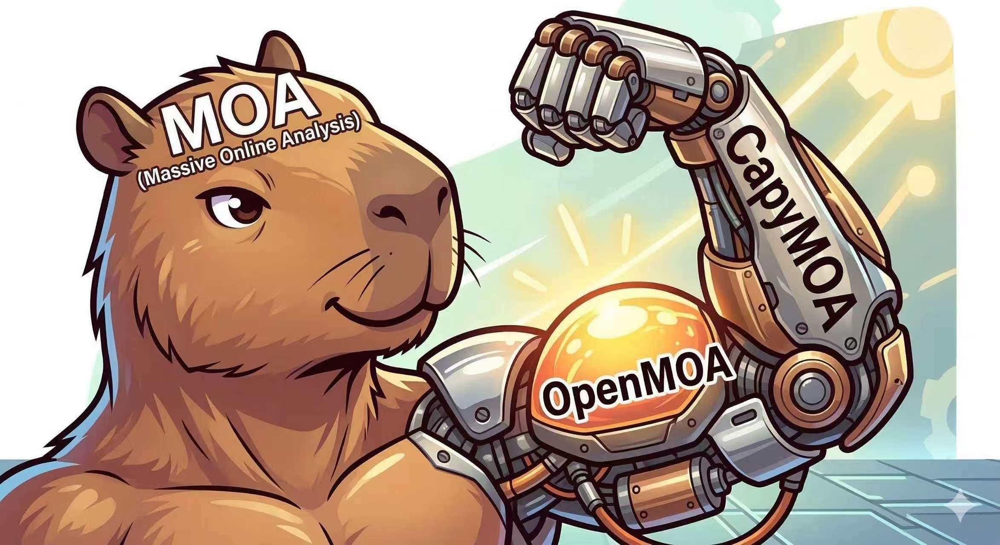

# [OpenMOA](https://openmoa.net)

<div align="center">



[](https://pypi.org/project/openmoa/)
[](https://discord.gg/spd2gQJGAb)
[](https://openmoa.net/docs/)
[](https://github.com/ZW-SIYUAN/OpenMOA)

**A unified Python library for Utilitarian Online Learning in dynamic feature spaces.**

[Documentation](https://openmoa.net/docs/) · [Tutorials](https://openmoa.net/docs/guide/tutorials/) · [Discord](https://discord.gg/spd2gQJGAb) · [Report an Issue](https://github.com/ZW-SIYUAN/OpenMOA/issues)

</div>

---

## What is OpenMOA?

Real-world data streams rarely stay the same. Sensors fail, features appear and disappear, and the world keeps changing — yet most online learning libraries assume a fixed feature space. **OpenMOA** is built for the messy reality.

OpenMOA is a Python library for **Utilitarian Online Learning (UOL)**: online learning under dynamic, evolving feature spaces. It provides:

- **10 state-of-the-art UOL algorithms** — from sparse linear models to deep graph neural networks
- **5 stream wrappers** — simulate every major type of feature-space evolution
- **Full integration with [CapyMOA](https://capymoa.org)** — access 30+ classic stream learners, 12 drift detectors, and 40+ datasets out of the box
- **Clean, consistent API** — train, predict, and evaluate with the same interface across all algorithms

> **⚠️ Early Development**
> OpenMOA is actively developed and the API may change before v1.0.0.
> If you run into issues, please [open a GitHub Issue](https://github.com/ZW-SIYUAN/OpenMOA/issues) or reach out on [Discord](https://discord.gg/spd2gQJGAb).

---

## Installation

OpenMOA requires **Java** (for MOA backend) and **PyTorch** (for deep learning algorithms).

```bash
# 1. Check Java is installed
java -version

# 2. Install PyTorch (CPU version)
pip install torch torchvision --index-url https://download.pytorch.org/whl/cpu

# 3. Install OpenMOA
pip install openmoa

# 4. Verify
python -c "import openmoa; print(openmoa.__version__)"
```

Having trouble? See the full [installation guide](https://openmoa.net/docs/getting-started/) for GPU support and platform-specific instructions.

---

## Quick Start

```python
from openmoa.datasets import Electricity
from openmoa.classifier import AdaptiveRandomForestClassifier
from openmoa.evaluation import prequential_evaluation

stream = Electricity()
learner = AdaptiveRandomForestClassifier(schema=stream.get_schema())

results = prequential_evaluation(stream, learner, window_size=1000)

print(f"Accuracy:  {results.cumulative.accuracy():.2f}%")
print(f"Kappa:     {results.cumulative.kappa():.4f}")
print(f"Wall time: {results.wallclock():.2f}s")
```

Running a UOL algorithm on an evolving feature stream is just as straightforward:

```python
from openmoa.stream import OpenFeatureStream
from openmoa.datasets import Electricity
from openmoa.classifier import OASFClassifier
from openmoa.evaluation import prequential_evaluation

# Simulate a pyramid feature-space evolution
stream = OpenFeatureStream(
    base_stream=Electricity(),
    evolution_pattern="pyramid",
    d_min=2,
    d_max=8,
    total_instances=45312,
)

learner = OASFClassifier(schema=stream.get_schema())
results = prequential_evaluation(stream, learner)
print(f"Accuracy: {results.cumulative.accuracy():.2f}%")
```

---

## UOL Algorithms

OpenMOA introduces 10 original algorithms designed specifically for dynamic feature spaces. Each handles the challenge of features appearing, disappearing, or changing over time.

| Algorithm | Type | Task | Key Idea |
|---|---|---|---|
| **FESL** | Linear ensemble | Classification / Regression | Detects feature-space shifts via Jaccard distance; learns a mapping matrix between old and new spaces |
| **OASF** | Sparse linear | Classification / Regression | Passive-Aggressive updates with L₁,₂-norm group sparsity on a ring-buffer weight matrix |
| **RSOL** | Sparse linear | Classification | Robust variant of OASF with stronger sparsity and larger sliding window |
| **FOBOS** | Proximal SGD | Classification | Forward-Backward Splitting with L1/L2/elastic-net regularization and adaptive step decay |
| **FTRL** | Adaptive linear | Classification | Follow-the-Regularized-Leader with per-coordinate learning rates and L1 sparsification |
| **OVFM** | Copula + SGD | Classification | Gaussian Copula EM for mixed continuous/ordinal data; dual observed+latent classifier ensemble |
| **OSLMF** | Semi-supervised | Classification | Extends OVFM with Density-Peak Clustering for label propagation on unlabeled instances |
| **ORF3V** | Stump forests | Classification | Per-feature decision stump forests with Hoeffding-bound pruning; naturally handles feature appearance/disappearance |
| **OLD3S** | VAE + HBP | Classification | Lifelong learning via VAE feature extraction and Hedge Backpropagation MLP; knowledge distillation during transitions |
| **OWSS** | Graph neural net | Classification | Bipartite instance-feature GNN with learnable feature embeddings and reconstruction alignment loss |

```python
from openmoa.classifier import (
    FESLClassifier, OASFClassifier, RSOLClassifier,
    FOBOSClassifier, FTRLClassifier, OVFMClassifier,
    OSLMFClassifier, ORF3VClassifier, OLD3SClassifier, OWSSClassifier,
)
```

---

## Stream Wrappers

Not sure which feature-evolution pattern fits your application? OpenMOA's stream wrappers let you simulate five distinct paradigms on any existing dataset:

| Wrapper | Pattern | Description |
|---|---|---|
| `OpenFeatureStream` | Pyramid / Incremental / Decremental / TDS / CDS / EDS | General-purpose wrapper; shrinks the active feature vector and attaches `feature_indices` to each instance |
| `TrapezoidalStream` | Trapezoidal | Fixed-size vectors with `NaN` masking for inactive features |
| `CapriciousStream` | Random missingness | Each feature independently absent with probability `missing_ratio` per step |
| `EvolvableStream` | Sequential partitions | Features rotate across `n_segments` groups with configurable overlap windows |
| `ShuffledStream` | Shuffled order | Buffers the entire stream and serves instances in a randomized sequence |

```python
from openmoa.stream import (
    OpenFeatureStream, TrapezoidalStream,
    CapriciousStream, EvolvableStream, ShuffledStream,
)
```

---

## Benchmark

Our benchmark evaluates ten representative UOL and OL algorithms across **12 binary** and **9 multi-class** datasets under three dynamic feature-space paradigms. All experiments use OpenMOA's unified API with standardized prequential evaluation, ensuring fair and reproducible comparison.

The following performance results are from the latest code review and optimization pass (Windows 11, Intel CPU, Python 3.13, NumPy 2.x):

| Optimization | Scenario | Before | After | Speedup |
|---|---|---|---|---|
| DensityPeaks vectorization | n = 50 instances | 0.151 ms | 0.047 ms | **3.2×** |
| DensityPeaks vectorization | n = 200 instances (default) | 1.492 ms | 1.109 ms | **1.3×** |
| ECDF → `np.searchsorted` | 10 observations | 0.0146 ms | 0.0042 ms | **3.5×** |
| ECDF → `np.searchsorted` | 100 observations (batch) | 0.0154 ms | 0.0038 ms | **4.0×** |
| `np.array` → `np.asarray` | float64, no conversion needed | 0.30 µs | 0.07 µs | **4.2×** |
| HBP weight update (OLD3S) | 3-layer MLP | 0.0269 ms | 0.0187 ms | **1.4×** |

**End-to-end throughput (400 training steps, d = 8 features):**

| Classifier | Total time | Per instance |
|---|---|---|
| OSLMF (batch = 50) | 51.0 ms | 0.128 ms |
| OVFM | 31.8 ms | 0.080 ms |

Benchmark code: [`demo/demo_fesl_benchmark_binary.py`](https://github.com/ZW-SIYUAN/OpenMOA/blob/main/demo/demo_fesl_benchmark_binary.py)

---

## What Else is Inside?

OpenMOA is built on top of [CapyMOA](https://capymoa.org) and inherits its full ecosystem:

- **30+ classic stream classifiers** — Hoeffding Tree, ARF, EFDT, Naive Bayes, kNN, and more
- **12 concept drift detectors** — ADWIN, DDM, HDDM, Page-Hinkley, ABCD (multivariate), and more
- **Regression support** — FIMTDD, ARFFIMTDD, SOKNL, ORTO, FESLRegressor, OASFRegressor
- **Semi-supervised evaluation** — `prequential_ssl_evaluation` with configurable label probability
- **Online Continual Learning** — `ocl_train_eval_loop` with forward/backward transfer metrics
- **40+ benchmark datasets** — Electricity, Covtype, RCV1, Fried, Bike, and more

---

## Cite Us

If you use OpenMOA in your research, please cite:

```bibtex
@misc{ZhiliWang2025OpenMOAAPythonLibraryforUtilitarianOnlineLearning,
    title={{OpenMOA}: A Python Library for Utilitarian Online Learning},
    author={Zhili Wang, Heitor M.Gomes and Yi He},
    year={2025},
    eprint={},
    archivePrefix={arXiv},
    primaryClass={cs.LG},
    url={https://arxiv.org/abs/},
}
```
